````markdown
# 🏎️ Swimming Traffic

Jogo de corrida divertido e desafiador, onde você controla carros, coleta moedas e percorre pistas evitando obstáculos.

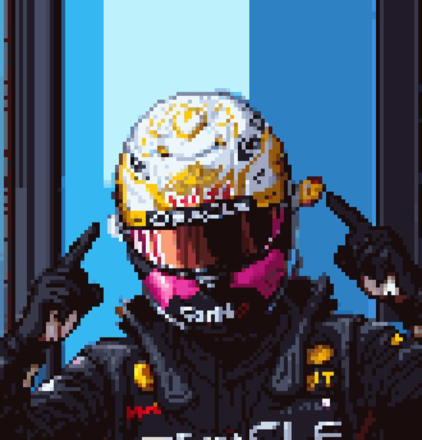

---

## 📖 Índice

- [Sobre](#sobre)
- [Gameplay](#gameplay)
- [Funcionalidades](#funcionalidades)
- [Instalação](#instalacao)
- [Como jogar](#como-jogar)
- [Carros disponíveis](#carros-disponiveis)
- [Tecnologias](#tecnologias)
- [Contribuição](#contribuicao)
- [Licença](#licenca)

---

## 💡 Sobre <a name="sobre"></a>

O **Swimming Traffic** é um jogo de corrida desenvolvido para diversão e desafio, simulando corridas em pistas urbanas.  
O jogador deve controlar o carro, coletar moedas, gerenciar o combustível e evitar colisões para conquistar novos veículos.

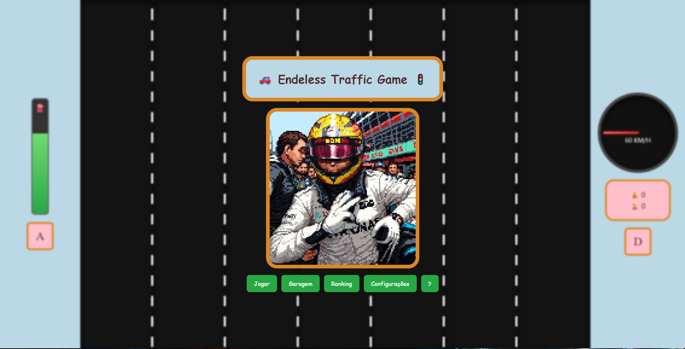

---

## 🎥 Gameplay <a name="gameplay"></a>

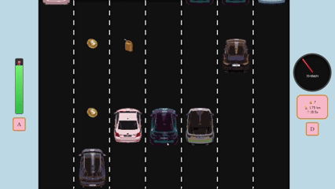  
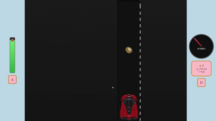

---

## ✨ Funcionalidades <a name="funcionalidades"></a>

- 🛣️ Diversas pistas para correr
- ⛽ Sistema de combustível dinâmico
- 💰 Coleta de moedas
- 🚗 Diferentes carros desbloqueáveis
- 🛠️ Modo desenvolvedor para testes
- 🎮 Controles simples e intuitivos

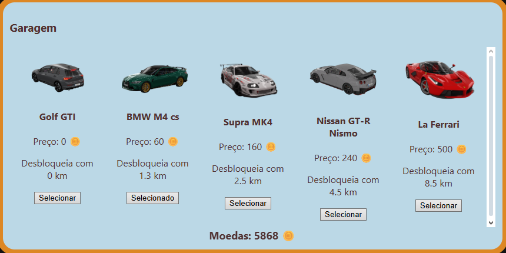

---

## 🛠️ Instalação <a name="instalacao"></a>

Para rodar o projeto localmente:

1. Clone o repositório:
   ```bash
   git clone https://github.com/seu-usuario/swimming-traffic.git
   ```
````

2. Entre na pasta do projeto:

   ```bash
   cd swimming-traffic
   ```

3. Instale as dependências:

   ```bash
   npm install
   ```

4. Execute o projeto:

   ```bash
   npm start
   ```

> ⚠️ Certifique-se de ter o **Node.js** instalado na versão recomendada.

---

## 🎮 Como jogar <a name="como-jogar"></a>

- Use as **setas do teclado** para controlar o carro
- **Colete moedas** e evite colisões
- **Gerencie o combustível** usando o medidor
- Desbloqueie **novos carros e pistas** conforme progride

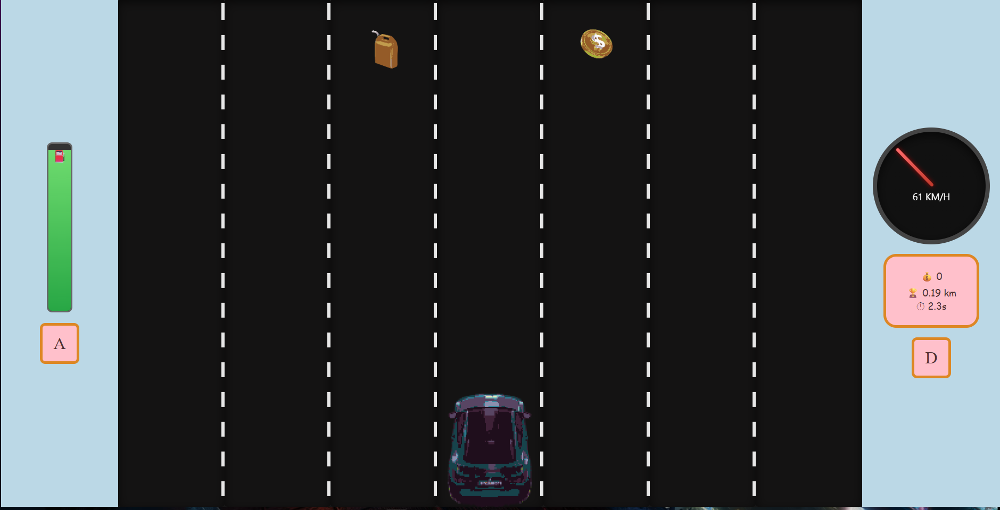

---

## 🚘 Carros disponíveis <a name="carros-disponiveis"></a>

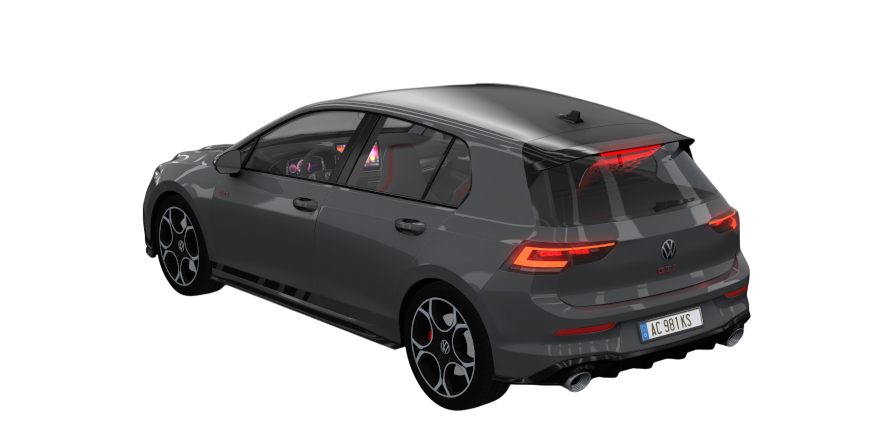 |
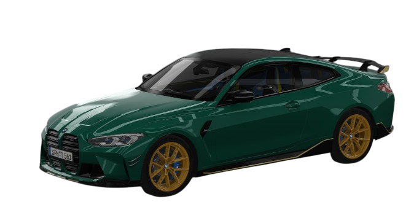 |
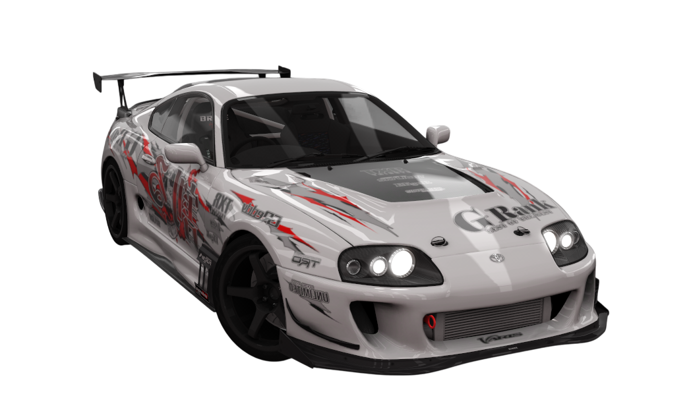 |
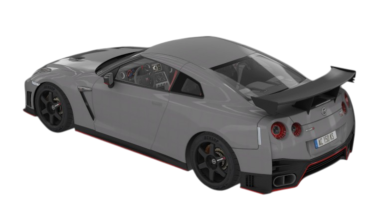 |
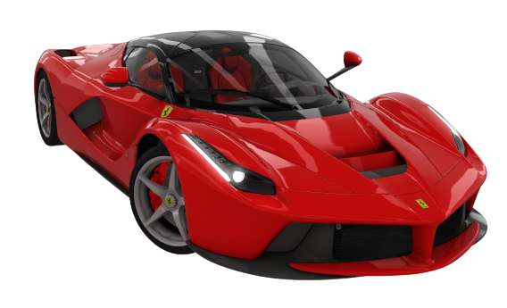 |

---

## 🧰 Tecnologias <a name="tecnologias"></a>

- **JavaScript** – lógica e interação do jogo
- **HTML/CSS** – layout e interface
- **Electron** – empacotamento e execução desktop
- **Node.js** – gerenciamento de dependências

---

## 🤝 Contribuição <a name="contribuicao"></a>

Contribuições são muito bem-vindas!

1. Faça um **fork** do projeto
2. Crie uma branch com sua feature:

   ```bash
   git checkout -b minha-feature
   ```

3. Faça commit das alterações:

   ```bash
   git commit -m "Minha contribuição"
   ```

4. Envie para sua branch:

   ```bash
   git push origin minha-feature
   ```

5. Abra um **Pull Request**

---

## 📄 Licença <a name="licenca"></a>

Este projeto está sob a licença **MIT**.
Consulte o arquivo [LICENSE](LICENSE) para mais detalhes.

```

```
